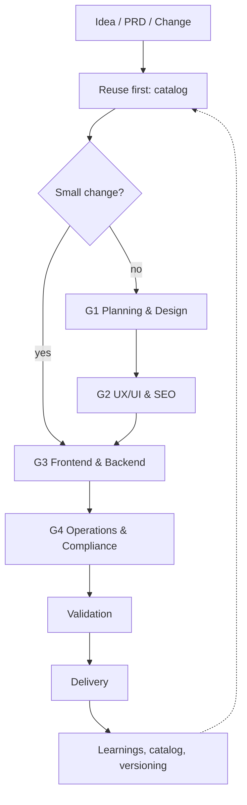

# Reyvit Framework

A lightweight, versioned method for AI-assisted product delivery: fewer rewrites, compliance from day one, reusable decisions.

## Groups
| Group | Focus | Doc |
|---|---|---|
| G1 | Scope, PRD, journeys, data model | [docs/G1-planning-design.md](docs/G1-planning-design.md) |
| G2 | UX/UI, accessibility, all SEO | [docs/G2-ux-ui-seo.md](docs/G2-ux-ui-seo.md) |
| G3 | Architecture, APIs, data, secrets | [docs/G3-frontend-backend.md](docs/G3-frontend-backend.md) |
| G4 | Privacy, security, performance, leads | [docs/G4-operations-compliance.md](docs/G4-operations-compliance.md) |

## Rules
1. Compliance is never skipped — even small changes pass G4.
2. SEO is decided in G2, implemented in G3.
3. Private keys never appear in code or documents.

See also: [tooling-map.md](tooling-map.md) · [CHANGELOG.md](CHANGELOG.md) · [skills/](skills/)
